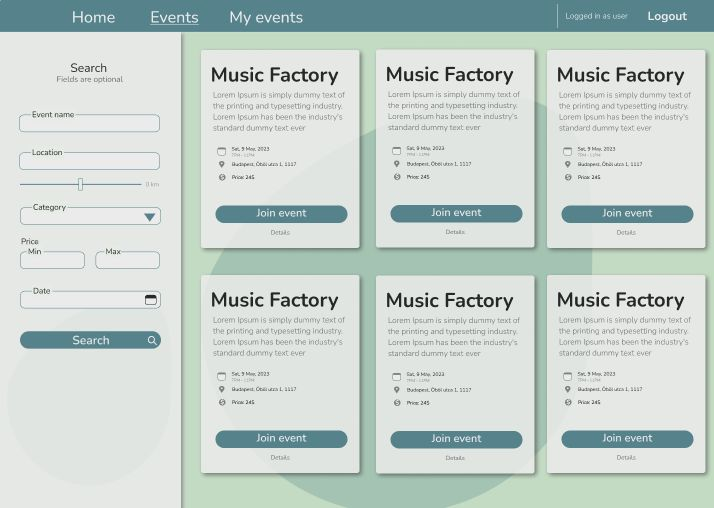

# Advanced-team-project

## Description
This is the repository for the Advanced Team Project Eventure. It is an ASP.NET application developed as part of the Advanced course at Codecool.

## What is the project about
This is a app for creating events, joining existing events around you. It's a helping tool for people who wants to have some company on their social events. 

## Prerequisites
- .NET Core SDK
- SQL Server

## Installation
1. Clone the repository: `git clone https://github.com/your-username/Advanced-team-project.git`
2. Navigate to the project directory: `cd Advanced-team-project`
3. Create an `appsettings.json` file similar to the `appsettingsample.json` file, but replace the connection string with your own database connection string.
4. Restore the dependencies: `dotnet restore`
5. Build the project: `dotnet build`
6. Run the application: `dotnet run`

## Usage
- Access the application in your web browser at `http://localhost:5000`

## Contributing
1. Fork the repository
2. Create a new branch: `git checkout -b feature/your-feature-name`
3. Make your changes and commit them: `git commit -m 'Add some feature'`
4. Push to the branch: `git push origin feature/your-feature-name`
5. Submit a pull request

## License
This project is licensed under the [MIT License](LICENSE).

## About the project

